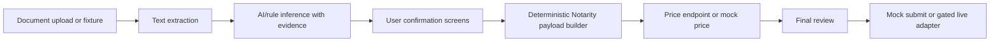

# Notarity Lens Report

## Problem

Users arrive with legal documents but do not know which booking route, country,
add-ons, required documents, shipping setup, or price applies. The risky term is
`destinationCountry`: users can confuse country of use with home, billing,
nationality, or shipping country.

## Solution

Notarity Lens makes the document the booking path. It loads or reads documents,
extracts evidence-backed facts, asks the user to confirm high-impact fields, and
turns those confirmed facts into a deterministic Notarity payload.

Joshua demonstrates the core value:

- Country of use: Spain
- Billing/home: United States
- Shipping: Spain
- Product route: NIE number application plus NIE Personal Data
- Apostille: required for the NIE application
- Hard copy: yes
- Price: EUR 580

## Architecture

Packages:

- `apps/web`: React/Vite Lens flow.
- `apps/api`: Hono API, mock routes, DeepSeek client, Notarity client.
- `packages/shared`: schemas, constants, persona fixtures.
- `packages/notarity`: condition engine, product resolver, price helpers,
  filename mapping, payload builder.
- `packages/ai`: prompt, extraction schema exports, inference mapper tests.

## Payload Flow

AI only proposes semantic facts with evidence:

- Spain / NIE
- Joshua Timms
- New York residence
- Barcelona shipping
- apostille and hard copy signals

Deterministic code maps confirmed facts to Notarity identifiers:

- `_bookingForm`: `kmVXjYM937qB8JTYG2yH`
- destination country: `ES`
- NIE product: `UpEJ7raQEKQKFhWn12r2`
- required companion product: `xK5IkgPX1LTYdWLFzW8X`
- timeslot fixture: `xitTkTMC18R0ZfCNtqyW`

The payload builder also normalizes filenames so `products[].files` match the
multipart file names expected by Notarity.

## AI Safety

- Mock AI is default.
- DeepSeek runs only on the backend when `MOCK_AI=false`.
- Document text, not raw PDF binary, is sent in live AI mode.
- Responses are parsed as JSON and validated with Zod.
- Validation failure falls back to Joshua fixture inference.
- Product IDs, prices, timeslots, and payload fields are never generated by the
  model.

## Notarity Safety

- Mock Notarity is default.
- Live reads and pricing are behind `MOCK_NOTARITY=false`.
- Live submit is blocked unless `ALLOW_LIVE_SUBMIT=true`.
- The current public-demo skeleton still refuses multipart live submit so the
  project cannot accidentally create legal bookings.

## Testing

Current automated coverage includes:

- condition engine routing for ES, AT, and generic branches
- NIE companion product auto-add
- Joshua payload critical fields
- filename normalization
- EUR 580 price total
- deterministic inference mapper country semantics
- API smoke routes for health, fixtures, infer, upload, price, and submit
- API validation for unknown personas, non-PDF uploads, and invalid
  price/submit payloads

Manual browser verification covered the Joshua path from start to success on the
local dev server. Later verification also covered Robert and Elizabeth sample
selection through final review, plus mobile selector layout at `390x844`.

## Known Limitations

- PDF extraction is fixture-backed for the hackathon demo.
- Arbitrary uploaded PDFs currently produce reviewable upload metadata, not a
  complete deterministic payload.
- QR phone upload is not implemented.
- Click-to-highlight PDF coordinates are represented as evidence chips and text
  panels, not true PDF bounding-box highlights.
- Robert and Elizabeth are supported fallback sample branches, but their fixture
  inference depth is intentionally lighter than Joshua's main demo.
- Live multipart submit is intentionally not enabled.
