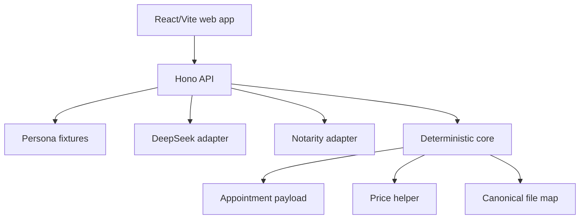

# Architecture

Notarity Lens separates AI inference from deterministic booking logic.

## Principles

- AI extracts candidate facts with evidence.
- Users confirm high-impact fields.
- Deterministic code maps confirmed facts to Notarity config, products, price,
  timeslots, and payload.
- Server pricing is authoritative in live mode.
- Live submit is gated.

## Runtime Components

## Mock Mode

The default demo mode uses:

- Joshua, Robert, or Elizabeth fixture documents and extracted text.
- persona fixture inference.
- mock booking form and product fixtures.
- mock timeslot `xitTkTMC18R0ZfCNtqyW`.
- mock price lines totaling EUR 580.
- mock submit id `mock_appt_*`.

Uploaded PDFs use `/api/documents/upload` to return session and file metadata.
That metadata is visible in the analyze screen, but arbitrary uploaded PDFs do
not yet drive deterministic payload generation.

## Live Mode Boundaries

`MOCK_AI=false` enables backend DeepSeek inference if `DEEPSEEK_API_KEY` is set.
Failures fall back to fixtures.

`MOCK_NOTARITY=false` enables Notarity read/price adapters if credentials are
provided. Live submit is still blocked unless `ALLOW_LIVE_SUBMIT=true`, and the
public demo skeleton refuses multipart live submit.

## Data Contracts

Shared Zod schemas live in `packages/shared/src/schemas.ts`:

- `EvidenceRef`
- `FieldStatus`
- `InferredField`
- `DocumentFactExtraction`
- `PriceLine`
- `NotarityProductSelection`
- `AppointmentPayload`
- `LensDraft`
- `PersonaFixture`
